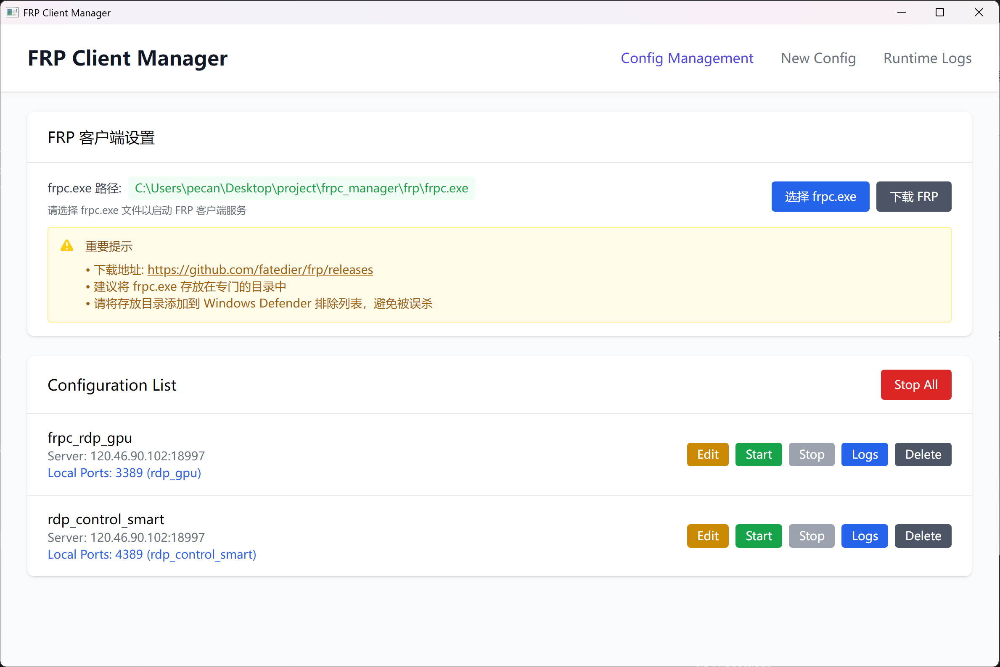

# FRP Client Manager

[中文说明](README_CN.md) | English

A modern GUI management tool for FRP (Fast Reverse Proxy) client, built with Electron + React + TypeScript.




## 🌟 Features

### 📋 Configuration Management

- **Visual Configuration Creation** - Create FRP configurations through a user-friendly form interface
- **TOML Advanced Editor** - Direct editing of raw TOML configuration files
- **Configuration Validation** - Built-in syntax validation and configuration integrity checks
- **Import/Export Configurations** - Support loading and saving configurations from/to files

### 🚀 Multi-Process Execution

- **Parallel Execution** - Support running multiple FRP configurations simultaneously
- **Independent Control** - Each configuration can be started and stopped independently
- **Status Management** - Real-time display of each configuration's running status
- **Process Isolation** - Each configuration runs in an isolated process

### 📊 Monitoring & Logging

- **Real-time Logs** - View real-time logs from all FRP processes
- **Process Identification** - Logs clearly identify output from each process
- **Log Management** - Support clearing and searching log content

### 🛠️ Advanced Features

- **Port Information Display** - Show local port information for each configuration
- **Error Handling** - Comprehensive error boundaries and user-friendly error messages
- **State Persistence** - Automatic saving of configurations and running states
- **Portable Version Support** - Support for portable deployment

## 🖥️ System Requirements

- Windows 10/11 (64-bit)
- FRP client (frpc.exe) must be pre-installed

## 📦 Installation & Usage

### Option 1: Download Pre-built Version

1. Download the latest version from [Releases]([https://github.com/hyper-fa/frpc_manager/releases])
2. Extract to any directory
3. Run `frpc-manager.exe`

### Option 2: Build from Source

```bash
# Clone repository
git clone https://github.com/hyper-fa/frpc_manager.git
cd frpc-manager

# Install dependencies
npm install

# Run in development mode
npm run dev

# Build production version
npm run build

# Package application
npm run dist
```

## 🚀 Quick Start

### 1. Initial Setup

1. After launching the application, first set the FRP client path
2. Click "Select frpc.exe Path" button and choose your frpc.exe file

### 2. Create Configuration

1. Click the "New Config" tab
2. Fill in basic information like server address, port, auth token, etc.
3. Add Visitors configuration as needed
4. Click "Save Configuration"

### 3. Advanced Editing

1. Click the "Edit" button in the configuration list
2. Enter TOML advanced editing mode
3. Directly edit raw configuration file content
4. Click "Test Configuration" to validate syntax
5. Click "Save Configuration" after validation passes

### 4. Runtime Management

1. Click "Start" button in the configuration list to start a configuration
2. Support running multiple configurations simultaneously
3. Click "Stop" button to stop a specific configuration
4. Click "Stop All" button to stop all running configurations

### 5. Log Viewing

1. Click the "Runtime Logs" tab
2. View real-time logs from all FRP processes
3. Logs will identify output from each configuration

## 📁 Project Structure

```
frpc-manager/
├── src/
│   ├── main/           # Electron main process
│   │   ├── main.ts     # Main process entry
│   │   └── preload.ts  # Preload script
│   └── renderer/       # React renderer process
│       ├── components/ # React components
│       ├── stores/     # State management
│       └── types/      # TypeScript type definitions
├── dist/               # Build output
├── frp/               # FRP configuration files directory
└── configs.json       # Application configuration storage
```

## 🔧 Configuration File Format

The application supports standard FRP TOML configuration format:

```toml
serverAddr = "your-server.com"
serverPort = 7000

[auth]
method = "token"
token = "your-token"

[[visitors]]
name = "visitor-name"
type = "xtcp"
serverName = "server-name"
bindPort = 6000
secretKey = "your-secret"

[[proxies]]
name = "proxy-name"
type = "tcp"
localIP = "127.0.0.1"
localPort = 3389
remotePort = 6001
```

## 🛠️ Development Guide

### Tech Stack

- **Electron** - Cross-platform desktop application framework
- **React** - User interface library
- **TypeScript** - Type-safe JavaScript
- **Tailwind CSS** - Utility-first CSS framework
- **Zustand** - Lightweight state management
- **Vite** - Fast build tool

### Development Commands

```bash
npm run dev          # Development mode
npm run build        # Build project
npm run dist         # Package application
npm run lint         # Code linting
```

## 🤝 Contributing

Issues and Pull Requests are welcome!

1. Fork this repository
2. Create a feature branch (`git checkout -b feature/AmazingFeature`)
3. Commit your changes (`git commit -m 'Add some AmazingFeature'`)
4. Push to the branch (`git push origin feature/AmazingFeature`)
5. Open a Pull Request

## 📄 License

This project is licensed under the MIT License - see the [LICENSE](LICENSE) file for details.

## 🙏 Acknowledgments

- [FRP](https://github.com/fatedier/frp) - Excellent intranet penetration tool
- [Electron](https://electronjs.org/) - Cross-platform desktop application framework
- [React](https://reactjs.org/) - User interface library

## 📞 Support

If you encounter issues or have suggestions, please:

- Submit an [Issue](https://github.com/your-username/frpc-manager/issues)
- Send email to: fusion.ai726@gmail.com

---

⭐ If this project helps you, please give it a star!
